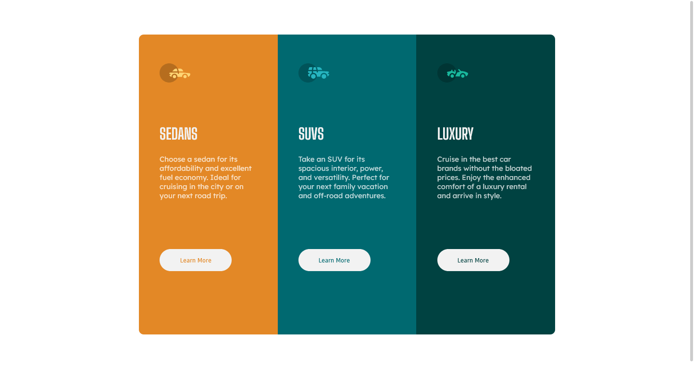
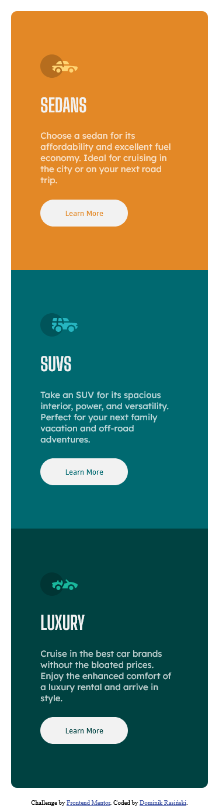

# Frontend Mentor - 3-column preview card component solution

This is a solution to the [3-column preview card component challenge on Frontend Mentor](https://www.frontendmentor.io/challenges/3column-preview-card-component-pH92eAR2-). Frontend Mentor challenges help you improve your coding skills by building realistic projects. 

## Table of contents

- [Overview](#overview)
  - [The challenge](#the-challenge)
  - [Screenshot](#screenshot)
  - [Links](#links)
- [My process](#my-process)
  - [Built with](#built-with)
  - [What I practiced](#what-i-practiced)
  - [Continued development](#continued-development)
  - [Useful resources](#useful-resources)
- [Author](#author)
- [Acknowledgments](#acknowledgments)


## Overview

### The challenge

Users should be able to:

- View the optimal layout depending on their device's screen size
- See hover states for interactive elements

### Screenshot

- Screenshot for loyout of 1444px 



- Screenshots for loyout of 375px




### Links

- Solution URL: [Add solution URL here](https://your-solution-url.com)
- Live Site URL: [Add live site URL here](https://your-live-site-url.com)

## My process

### Built with

- Semantic HTML5 markup
- CSS custom properties
- CSS Flexbox
- CSS Grid
- Mobile-first workflow
- Media Queries

### What I practiced

In this challenge I was practiced my skills mappings of loyout from .jpeg files, and also I reminded how to use CSS grid, flexbox and mathod for creating pages what is called mobile first. 

```html
<div class="grid-wrapper">
    <section class="Sedans">
      
      <h1>Sedans</h1>
      <p>
        Choose a sedan for its affordability and excellent fuel economy. Ideal for cruising in the city
        or on your next road trip.
      </p>
      <button>Learn More</button>
    </section>
  ...More code
</div>
```
```css
.grid-wrapper{
    display: grid;
    grid-template-columns: 1fr;
    grid-template-rows: 1fr 1fr 1fr;
    padding: 5%;
}
```

### Continued development

What I must to polish, on this project I was saw how bad I know media queries, so in next projects I must learn more about media queries.

### Useful resources

- [MDN Web Docs](https://developer.mozilla.org/pl/docs/Web/CSS/Media_Queries/Using_media_queries) - This resorces was help me with create, a media query breakpoints.

## Author

- Website - [Add your name here](https://www.your-site.com)
- Frontend Mentor - [@DominikRasinski](https://www.frontendmentor.io/profile/DominikRasinski)


## Acknowledgments

This is where you can give a hat tip to anyone who helped you out on this project. Perhaps you worked in a team or got some inspiration from someone else's solution. This is the perfect place to give them some credit.


